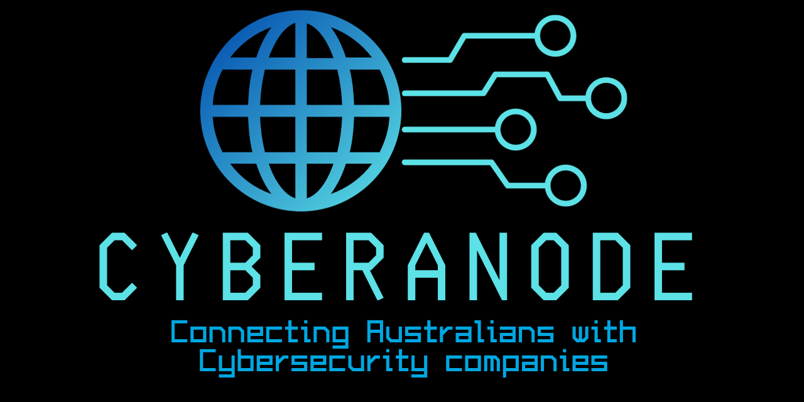

# CyberAnode

## Introduction

Welcome to CyberAnode, your go-to directory for verified cyber security services in Australia. In response to the evolving digital landscape and the need for a reliable resource, we have created CyberAnode to connect businesses and individuals with reputable cyber security companies.

## Purpose

CyberAnode aims to address the shortcomings of existing platforms by providing a curated list of cyber security companies that offer verified services. Unlike other directories, we prioritise accuracy and transparency to ensure that users can confidently choose the right cyber security partner for their specific needs.

## Features

### 1. **Verification Process**
   - Companies listed on CyberAnode undergo a thorough verification process to ensure the accuracy of the information provided.
   - We validate the cyber security services offered by each company, giving you confidence in the accuracy of the directory.

### 2. **Credibility**
   - CyberAnode is committed to maintaining a high standard of credibility. Companies listed here are carefully vetted to meet stringent criteria.
   - Our goal is to foster trust between users and cyber security service providers, promoting a safer digital environment.

### 3. **User-Friendly Interface**
   - We have designed CyberAnode with user experience in mind. The website is easy to navigate, allowing you to quickly find the cyber security services you need.

### 4. **Dynamic and Updated Information**
   - Unlike outdated directories, CyberAnode regularly updates information to reflect the current offerings of listed companies.
   - Users can trust that the directory provides the most up-to-date information on cyber security services in Australia.

## Why Choose CyberAnode?

- **Reliability:** We prioritise accuracy and reliability in our directory, ensuring that the listed companies meet stringent criteria.
  
- **Transparency:** CyberAnode provides transparent information about each cyber security company, empowering users to make informed decisions.

- **Security:** In the ever-changing landscape of cyber security, trust is paramount. CyberAnode helps you find reputable companies to secure your digital assets.

## Getting Started

1. **Browse Companies:** Explore our directory to discover a wide range of cyber security services offered by verified companies.
   
2. **Verify Services:** Each company listing provides detailed information about the cyber security services they offer. 

3. **Connect:** Contact the cyber security companies directly through the information provided on their respective pages.

4. **Stay Informed:** Check back regularly for updates and new additions to our curated directory.

## Feedback

We value your feedback! If you have suggestions, encounter issues, or want to recommend a cyber security company for inclusion, please [contact us](mailto:feedback@cyberanode.com).

Thank you for choosing CyberAnode - your trusted source for verified cyber security services in Australia.
