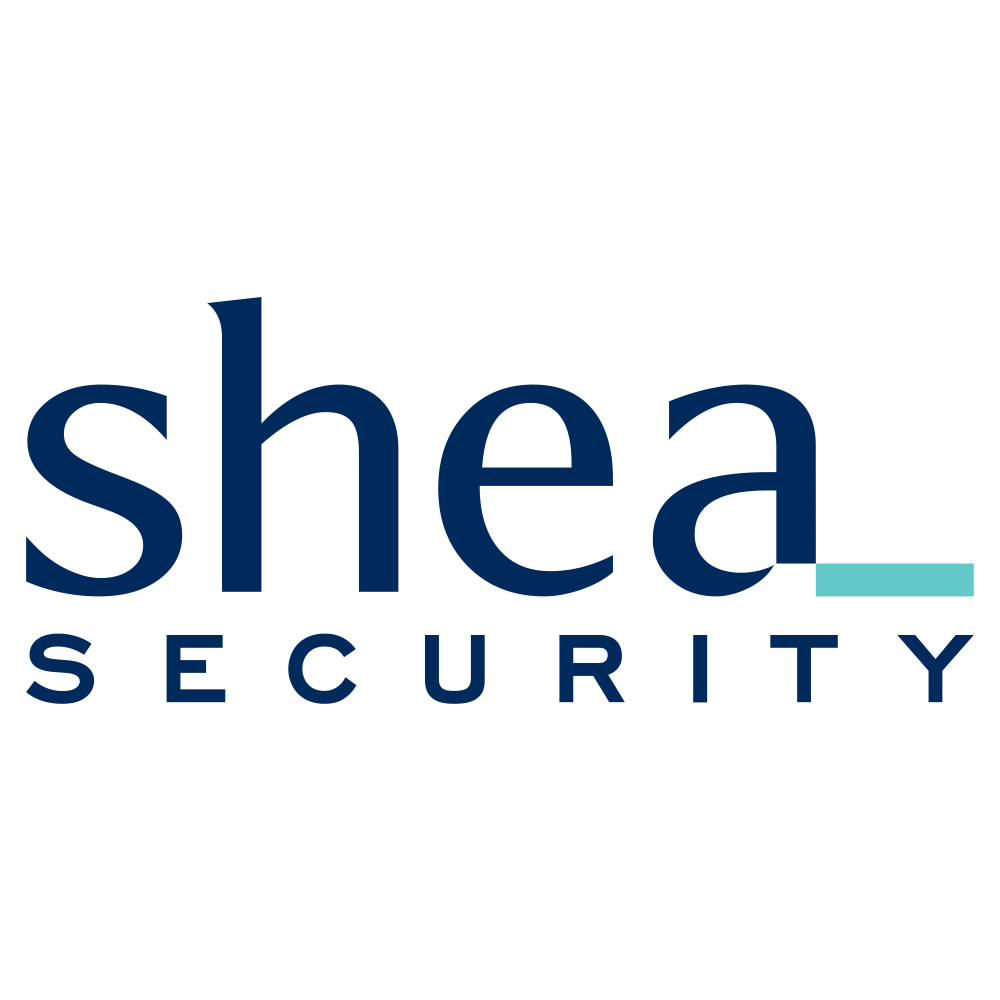

# Shea Security Pty Ltd

:office: Level 4, 152 Elizabeth Street, Melbourne, VIC, 3000

:flags: Australian owned
:flags: Private company

:small_blue_diamond: [Visit site](https://sheasecurity.com.au/)

## Overview

Based in Melbourne and founded in 2018. Our work involves testing the security of computer systems, applications and networks. Additionally, we provide education and training to software developers and IT professionals based on our testing and research. We have considerable experience in penetration testing (pentesting) for some of Australia's most widely known companies. This includes working closely with security engineers and managers as they continuously adjust and improve the security of their systems.

## Cyber security solutions

* Black box testing
* White box testing / source code review
* Web application testing
* Application Program Interface (API) testing
* Mobile application testing
* Internal network testing
* Perimeter testing and monitoring of externally facing assets
* Cloud testing
* PCI testing
* Physical products including IOT and embedded devices
* Security training for developers
* Security awareness training
* Security culture programs

## Services descriptions
### [Penetration Testing](https://sheasecurity.com.au/)

### [Security Training](https://sheasecurity.com.au/)