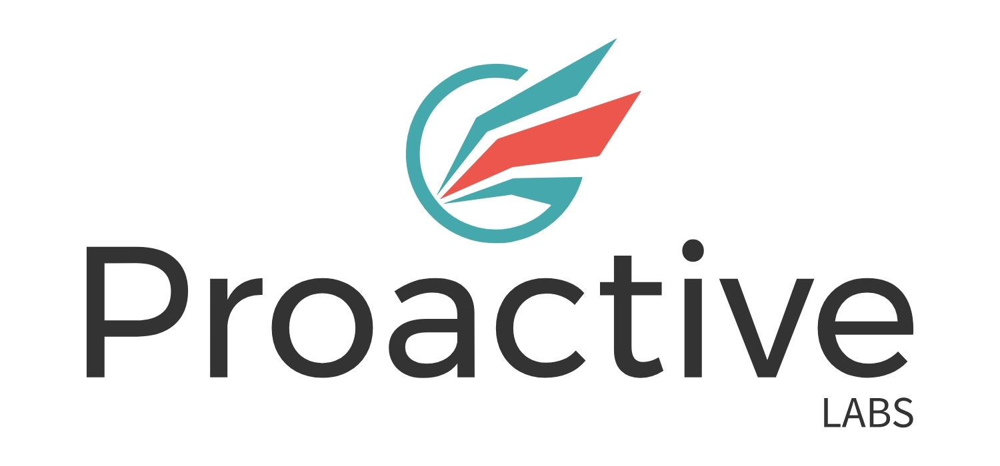

# Proactive Labs Pty Ltd

:office: Suite 78 M Centre 11 Palmerston Lane Manuka ACT 2603

:flags: Australian owned
:flags: Private company

:small_blue_diamond: [Visit site](https://www.proactivelabs.com)

## Overview

Proactive Labs is a boutique cyber security company, offering a different perspective on cyber issues. We aim to help our clients in their domain, by offering our experience in ours. We are highly skilled and experienced cybersecurity professionals offering comprehensive, yet boutique cybersecurity services to businesses and organisations. With extensive professional experience, we possess an in-depth understanding of the dynamic Canberra market. To cater to its specific and unique needs, we offer tailored and customised solutions. We provide services such as penetration testing, threat emulation, code review, and bespoke research.

## Cybersecurity solutions

* Penetration Testing
* Web application penetration testing
* Application Programmer Interface (API) penetration testing
* Infrastructure penetration testing
* External/Internal network penetration testing
* Mobile assessment penetration testing
* Standard Operating Environment (SOE) assessments
* Code Review
* Red Team engagements

## Services descriptions
### [Penetration Testing](https://www.proactivelabs.com.au/services/index.html)