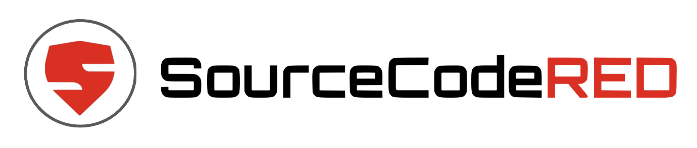

# SourceCodeRED

:office: 16 Nexus Way, Southport, QLD 4213

:flags: Australian owned
:flags: Private company

:small_blue_diamond: [Visit site](https://sourcecodered.com)

## Overview

SourceCodeRED is the next generation of DevSecOps.  We provide a complete, end-to-end DevSecOps experience for our customers.  Our team can build modern cloud-enabled web applications, design secure CI/CD pipelines and manage complex application runtimes. 

## Cybersecurity solutions

* DevSecOps Consultancy
* Managed DevSecOps
* Design and implementation of secure CI/CD pipelines
* Software Development Red Team
* Web application, cloud and API testing

## Services descriptions
### [DevSecOps Consultancy](https://sourcecodered.com/devsecops-consultancy/)
Collectively, our team has decades of experience building and managing secure application environments.  We understand your infrastructure and business goals and how to provide business value within the context of a DevSecOps programme.  We can provide advice on designing and implementing a robust cloud-native security plan.

### [Managed DevSecOps](https://sourcecodered.com/managed-devsecops/) 
SourceCodeRED exists to give our customers access to a team of highly skilled and experienced DevSecOps practitioners via a managed service product.  Customers pay a flat monthly fee and get dedicated access our services and our elastic workforce.  Need CI/CD help one week?  No worries.  Need some code review or help with some vulnerable libraries the next week?  No problem.  

### [Software Development Redteam Training](https://sourcecodered.com/attacking-and-defending-the-software-supply-chain/)
Our training helps your software engineering and security teams level up by showing them a step-by-step guide to attacking (and defending!) the software supply chain.

### [Penetration Testing](https://sourcecodered.com/penetration-testing/)
SourceCodeRED specializes in testing and auditing software development processes, web application penetration testing, and identifying security issues in your CI/CD workflows.
