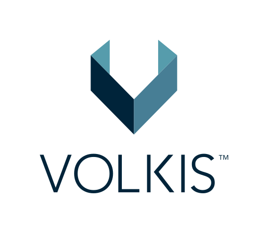

# Volkis Pty Ltd

:office: PO Box 55, Crows Nest NSW 1585

:flags: Australian owned
:flags: Private company

:small_blue_diamond: [Visit site](https://www.volkis.com.au)

## Overview

We're a group of hackers who want to keep those around us safe in the online world by doing what we love. With bespoke penetration tests and red teams, we aim to protect our friends, community, clients, and their customers, so that they can keep doing what they love. We focus on our niche rather than "full stack security", so we can help clients get a measurable increase in security against realistic attacks, instead of theoretical scenarios.

Everything we do is from the hacker's mindset. Thinking this way and applying it to each client's unique context, we tailor each engagement to that client's goals. Rather than changing the scope to fit our services, we change the service to fit you.

Transparency is one of our core values (check out our [Handbook](https://handbook.volkis.com.au)) and being involved with the infosec community keeps us honest. With us, you know what you're getting.

(We also make awesome T-shirts and stickers!)

## Cyber security solutions

We focus on the 3 high-level things we love doing:

1. Offensive Security: Attack-style services where we try to hack or break into your systems, servers, applications, and buildings. The goal here is to do like the attackers do, and identify areas of weakness that can be improved upon. This includes all manner of Penetration Testing (pentesting), Red Team engagements, Social Engineering, Physical Intrusion, and anything else that involves hacking!
2. Security Reviews: "If an attacker somehow lands in one of your environments, how do we make their life hell?" Security reviews aim to answer that question by highlighting areas of improvement in various environments. These improvements will either make it too frustrating or too difficult for attackers, while giving you time to detect them. We offer reviews of Active Directory, Microsoft 365, Windows 11/MacOS Standard Operating Environments, AWS, Azure Cloud, and Kubernetes.
3. Governance, Risk, and Compliance (GRC): Have a plan for your security. We help with ACSC Essential 8, ISO27001, NIST, PCI-DSS, and general security strategies.

## Services descriptions
### [Penetration Testing](https://www.volkis.com.au/services/penetration-testing/)
Service_category: Penetration testing
We use the same hacking tools and techniques as attackers do to find as many vulnerabilities at possible. These vulnerabilities are always tied back to business impact to provide a realistic assessment of your security posture. We perform the following types regularly, but are not restricted to just these:

- Internal Pentest
- External Pentest
- Wireless Pentest
- Web app Pentest
- Mobile app pentest

### [Red Team / Adversary simulation](https://www.volkis.com.au/services/red-team/)

As close to a real-world hack as you're (legally) going to get. We employ the same tools, techniques, and attacks that real adversaries use and go after business-level objectives. This exercises tests your detection and response capabilities over a period of typically 2-4 months.

### [Social Engineering](https://www.volkis.com.au/services/social-engineering/)

Using either email (phishing), phone calls (vishing), text messages (SMishing), or malicious USB drops, we try to trick your employees into providing credentials or running malware. By creating a new, custom campaign each time, employees get the hang of detecting future, real social engineering attempts.

### [Physical Intrusion](https://www.volkis.com.au/services/physical-intrusion/)

Your on-prem systems are only as secure as the physical protections. We try to break into your offices/warehouses/buildings by using a combination of physical attack & bypass tools, and social engineering.

### [Security Review](https://www.volkis.com.au/services/security-review/)

Make life harder for attackers by strengthening the security of your most critical environments such as Windows 11/MacOS SOE, Active Directory, Microsoft 365, AWS, Azure Cloud, and Kubernetes.

### [Compliance](https://www.volkis.com.au/services/compliance/)

Ensure you're compliant to a particular framework such as the ACSC Essential 8 Maturity Model, ISO27001, or NIST Cybersecurity Framework. We help you get to an audit-ready state.